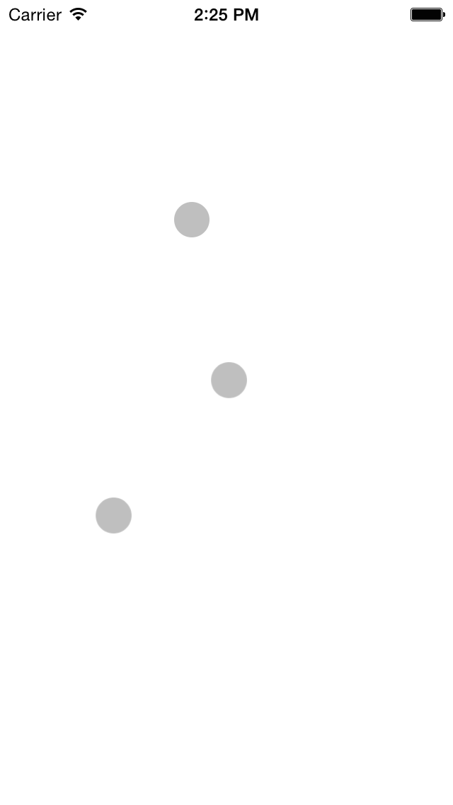
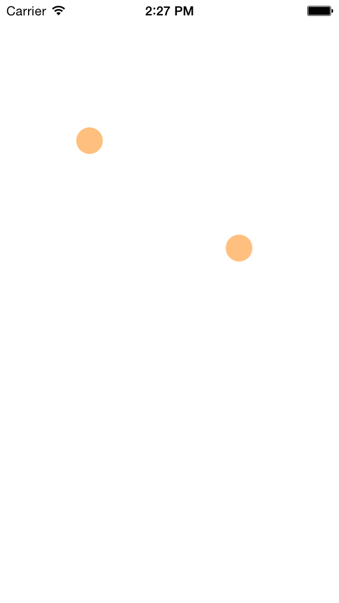

SGTouchPointer
===================


**This SGTouchPointer can let you show the touches on the Screen when you're using AirPlay.**

**This helps you can also to block touch event dispatch during presentation. Just lay down your device on the table. (when the device orientation is UIDeviceOrientationFaceUp)**

####* Note that all files are ARC only


# Sample Project Screens
**1. Normal Mode**



**2. Presentation Mode (touch will not effect)**




# INSTALL

## via git submodule

* Add it by git

```
 git submodule add https://github.com/SanggeonPark/SGTouchPointer submodules/SGTouchPointer
```
* Add the files you need to your xcode project.

## via Cocoapods

* Add the following line to your podfile (includes default files to your project aka UIKit and Foundation):

```
pod 'SGTouchPointer'
```

# Publishing

1. Update `SGTouchPointer.podspec`
2. Run `pod lib lint` to check for errors and 
3. Tag the version
4. `pod trunk push`

More infos :
* http://guides.cocoapods.org/making/using-pod-lib-create.html
* http://guides.cocoapods.org/making/getting-setup-with-trunk